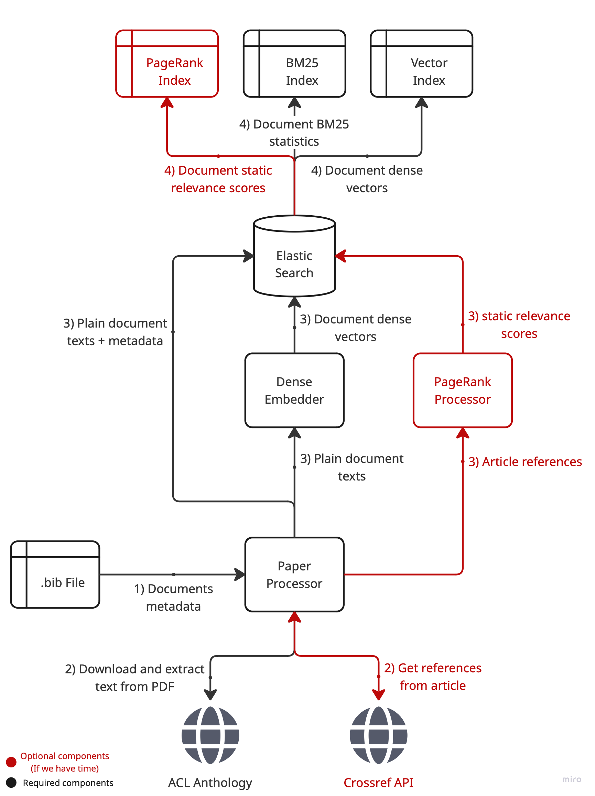
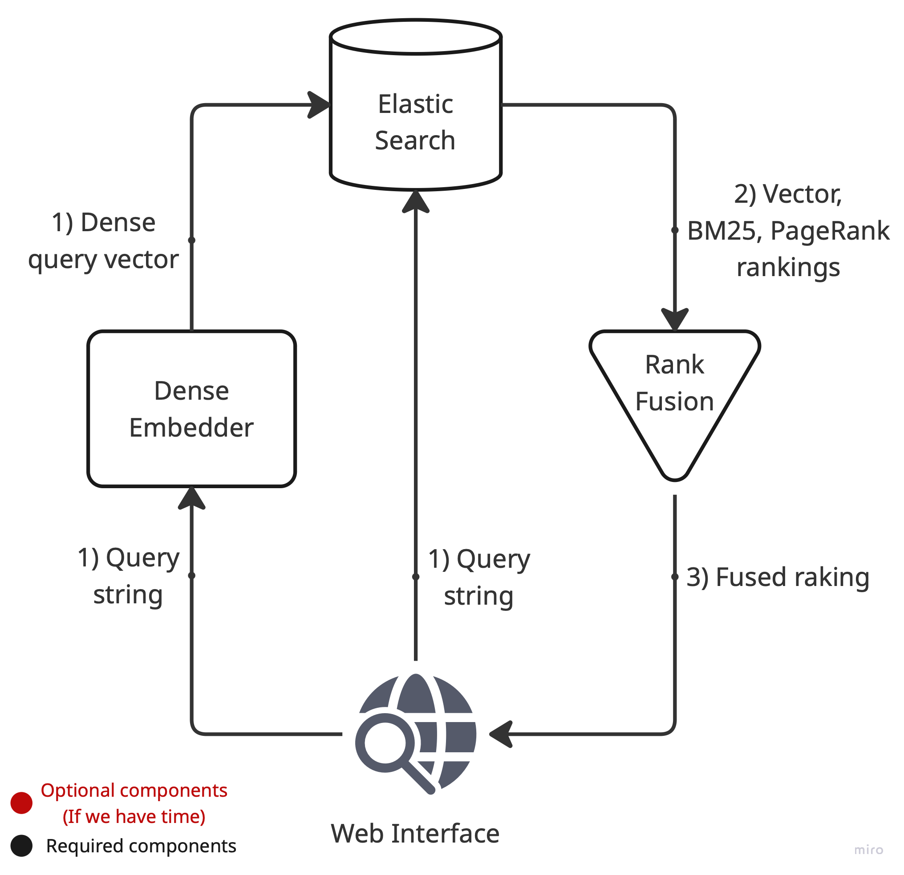

This document follows guidelines from MLSD lectures (in progress) by the author of the [book](https://www.manning.com/books/machine-learning-system-design). Consequently it may deviate slightly from the original [9-Step ML System Design Formula](https://github.com/alirezadir/Machine-Learning-Interviews/blob/main/src/MLSD/ml-system-design.md#7-prediction-service).

## 1. Problem Statement

### 1.1 Context and Background
The ACL Anthology is an open, community-maintained collection of more than 100 000 peer-reviewed papers covering computational linguistics and natural language processing research since 1965. While the anthology is an indispensable source for the field, its current search interface is limited to simple keyword matching on paper titles.

### 1.2 Existing Limitations
1. **Title-only search** Authors frequently craft creative or ambiguous titles that do not fully reflect the technical content of their work, making keyword-based title search unreliable.
2. **Hidden knowledge in full text** Key information about methods, datasets, results and limitations lives in actual text sections that are invisible to the current search.
3. **Inefficient literature discovery** Researchers must rely on external engines or manual exploration, leading to missed related work and duplicated effort.

### 1.3 Goals of the Planned System
The proposed search engine will:
* Index the full PDF content of English-language papers in the anthology.
* Enable natural-language and keyword queries about any part of a paper's content (e.g., "transformer compression methods").
* Return ranked results.
* Expose an API that downstream tools (e.g., literature-review assistants) can call.

### 1.4 Anti-Goals (Out of Scope of the Project)
* Index the whole anthology. We will try to index as much as possible, but considering time constraints, this is not a goal.
* Latency SLA for the search engine.
* Multilingual search beyond English.
* Continuous ingestion of new papers

### 1.5 Open Questions
* Primary stakeholders and success criteria remain to be defined.
* Constraints regarding external services or licensing are still unclear.

## 2. Data

### 2.1 Data Sources
* **Anthology index (.bib).**  The [BibTeX dump](https://aclanthology.org/anthology.bib.gz) lists every paper with title, authors, year and URL. It defines the canonical set of documents to index and drives the rest of the pipeline. We've used dump from 12.06.2025. 
* **PDFs from ACL Anthology storage.**  For each entry in the .bib file we download the corresponding full-text PDF.

### 2.2 Stored Features
1. **BM25 inverted index** — enables exact and fuzzy term matching; required for traditional keyword search and provides a fast, memory-efficient baseline.
2. **Dense embeddings** — generated with the [Qwen3-Embedding-0.6B](https://huggingface.co/Qwen/Qwen3-Embedding-0.6B) model to support vector similarity search.  We adopt this model because it
   * has only 0.6 B parameters, so it can run on a modern laptop GPU/CPU without special hardware;
   * scores near the top of the [MTEB retrieval leaderboard](https://huggingface.co/spaces/mteb/leaderboard), indicating strong out-of-the-box quality;
   * handles inputs up to 32 k tokens, letting us embed full papers as a single chunk while we experiment with finer-grained chunking strategies.
3. **PageRank scores** *(optional, time-permitting)* — computed on the citation graph to capture global authority of a paper; acts as a popularity prior that can re-rank results when textual signals are tied.

### 2.3 Document Metadata
As the anthology contains more than 100 000 papers, storing full texts is not feasible. Instead, we will store the following metadata per document:
* `title`
* `authors`
* `year`
* `url`
* BM25 statistics and inverted word index.
* Dense embeddings of paper sections with forward index to documents.
* `pagerank` numeric field (optional; added once the citation graph is processed).

Note: the raw `text` field is *indexed* for BM25 but stored with `_source` disabled to save disk space; only metadata and embeddings are kept in the retrievable document source.

### 2.4 Storage Engine
All mentioned data is stored in **Elasticsearch** because it natively supports:
* Inverted indexes with configurable analyzers and BM25 scoring.
* Approximate nearest-neighbour vector search via the `dense_vector` field. Even though it provides a bit slower search in comparison to competitors (e.g Qdrant), we prefer a single engine for all rankings instead of maintaining separate services.
* Embedded Rank Fusion API.
* Field-level updates, allowing us to add PageRank later without re-indexing documents.
* Horizontal scaling and mature operational tooling, reducing infrastructure overhead compared with maintaining separate engines for text and vector search.

### 2.5 ETL Overview
<div align="center">

</div>

The pipeline follows the diagram above:
1. **Paper Processor**
   * Reads metadata from the .bib file and downloads the corresponding PDF.
   * Performs *coarse* text extraction using PDF parsing libraries (e.g. pdfminer); we deliberately skip OCR of scanned pages because processing ~100 k PDFs within reasonable time is infeasible.
   * Cleans the extracted text in-place: removes emails, URLs, reference lists, stand-alone numbers, LaTeX-style math **and simple tables** that would not be indexed by BM25.
   * Emits a sanitised string plus basic metadata (title, authors, year, section headers).
2. **Dense Embedder** converts the cleaned text into vector embeddings. More details in §2.2.
3. **Elasticsearch** receives the cleaned text, metadata and vectors.
4. *(Optional)* **PageRank Processor** fetches reference lists via Crossref, builds the citation graph and writes PageRank scores back to Elasticsearch.

Optional components are shown in red in the diagram and will be implemented only if time allows.

### 2.6 Test Dataset and Annotation
To evaluate relevance offline we will build a small hand-labelled benchmark:
1. Sample 20–30 papers of diverse years and topics from the .bib dump.
2. Prepare 10–15 natural-language queries.
3. For each query choose the top-5 most relevant papers considering full text.

In section 3 we will describe metrics and evaluation procedure in more detail.

### 2.7 Data Quality
The pipeline relies on fast, metadata-level PDF text extraction.  This choice accelerates processing but introduces several quality risks:

* **Legacy PDFs and scanned pages.**  Early ACL volumes could include image-only scans or non-standard encodings.  Without OCR these papers yield little or no text, reducing recall for historical queries.
* **Encoding noise.**  Broken Unicode, ligatures and misplaced newline characters can slip through metadata extraction, hurting BM25 tokenisation and embedding quality.
* **Non-English fragments.**  Although we focus on English papers, occasional multilingual abstracts or author names may add noise if not filtered.
* **Formulae and tables.**  Mathematical notation and tabular data are stripped during cleaning; this avoids index bloat but removes potentially useful keywords for niche queries.

During MVP we will accept these limitations.  A future iteration may introduce selective OCR for high-value legacy papers and heuristic validation (e.g., flagging documents with <500 characters after extraction) to trigger manual review.

## 3. Metrics
### 3.1 Offline Evaluation Metrics
The hand-labelled benchmark described in §2.6 contains 10–15 queries, each with up to five *binary* relevance judgements.  Given this scale and label format we choose the following metrics:

1. **Precision@5 (P@5)** – fraction of the top-5 returned documents that are relevant.
   *Why:* matches the size of our judgement pool and answers the practical question: "How much of the first screen is useful?"

2. **Recall@5 (R@5)** – proportion of all judged-relevant documents that appear within the top-5 results.
   *Why:* complements precision by revealing whether the engine surfaces the known relevant set; bounded and stable with our limited ground truth.

3. **Mean Reciprocal Rank (MRR)** – average reciprocal rank of the first relevant result across queries.
   *Why:* rewards placing at least one highly-relevant paper early, which is critical for researcher satisfaction when only one seminal work is sought.

4. **Normalized Discounted Cumulative Gain @5 (nDCG@5)** – position-weighted gain normalised across queries.
   *Why:* captures ordering quality beyond the first hit while coping well with binary labels; industry-standard for academic search.

5. **Mean Average Precision @5 (MAP@5)** – mean of average precision truncated at five results.
   *Why:* balances precision and recall over the ranked list and remains reliable with small, binary-labelled pools.

### 3.2 Online Evaluation Metrics
At this stage we will rely solely on offline evaluation; live user testing is postponed beyond the MVP because of time constraints.

## 4. MVP Architecture

### 4.1 Indexing Pipeline
The ETL flow in §2.5 ingests the ACL Anthology dump and produces three features per paper (BM25 statistics, dense vectors, optional PageRank).  The pipeline runs offline and can be re-executed when new papers arrive.

### 4.2 Search Pipeline
<div align="center">

</div>

1. A user submits a query through the web UI.
2. The backend first sends the query string to the **Dense Embedder**, which returns a query vector.
3. The raw query and its vector are then passed to **Elasticsearch**.  The engine executes two operations in a single request:
   * k-NN search on the stored dense vectors.
   * BM25 full-text match on the inverted index (optionally retrieving PageRank scores).
4. **Elasticsearch** performs hybrid rank fusion internally and returns the fused list.
5. The final list is sent back to the web layer for display.

### 4.3 Web Application
A lightweight interface built with **Streamlit** exposes a search bar and a result list of relevant papers.

### 4.4 Deployment
The MVP will run on a single server.

* **Elasticsearch** and the **Streamlit UI** are packaged as Docker containers.
* The **indexing pipeline** is executed separately as a standalone Python script (outside the containers) whenever we refresh or extend the corpus.

### 4.5 Component UML Diagram
```mermaid
classDiagram
    class BibParser {
        +list<BibEntry> extract_bib_entries(Path path)
    }

    class PaperProcessor {
        +Path download_pdf(str url)
        +str extract_text(Path pdf_path, bool ocr=False)
        +str clean_text(str raw)
    }

    class DenseEmbedder {
        +ndarray embed(str | list[str] text)
    }

    class ElasticsearchIndexer {
        +void create_index(str index_name, bool force_delete=False)
        +void index_documents(str index_name, Iterable<IndexedDocument> docs, int batch_size=500)
    }

    class IndexingPipeline {
        +void ingest_bib(Path bib_file, str index_name, ...)
    }

    class ElasticsearchRepository {
        +list<SearchResult> search(str query, int top_k=10)
    }

    class StreamlitUI {
        +void run()
        +void on_query_submit(str query)
    }

    class BibEntry {
        +str url
        +str title
        +list<str> author
        +int|str year
    }

    class IndexedDocument {
        +str title
        +list<str> author
        +int|str year
        +str url
        +str text
        +ndarray embedding
        +float pagerank
    }

    class SearchResult {
        +str id
        +str title
        +str snippet
        +float score
    }

    class ElasticsearchDB {
        <<database>>
    }

    %% Relationships
    BibParser --> IndexingPipeline
    PaperProcessor --> IndexingPipeline
    DenseEmbedder --> IndexingPipeline
    ElasticsearchIndexer --> IndexingPipeline
    PageRankProcessor --> IndexingPipeline

    IndexingPipeline --> ElasticsearchDB
    ElasticsearchIndexer --> ElasticsearchDB

    DenseEmbedder --> ElasticsearchIndexer
    StreamlitUI --> ElasticsearchRepository

    ElasticsearchRepository --> ElasticsearchDB